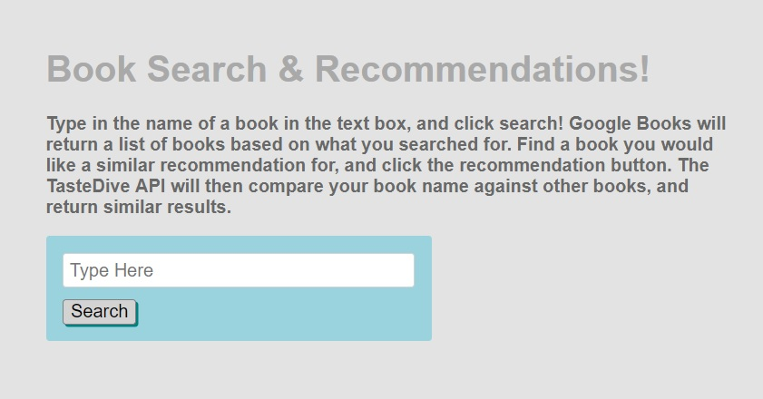
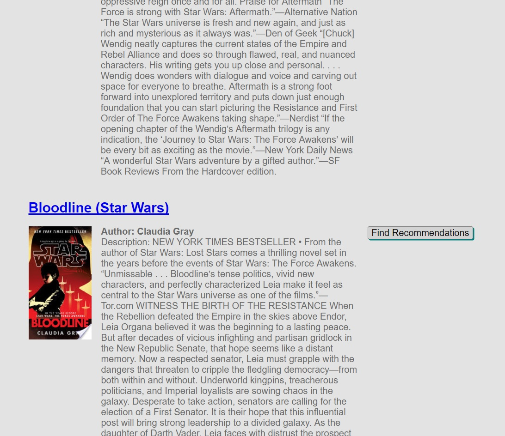
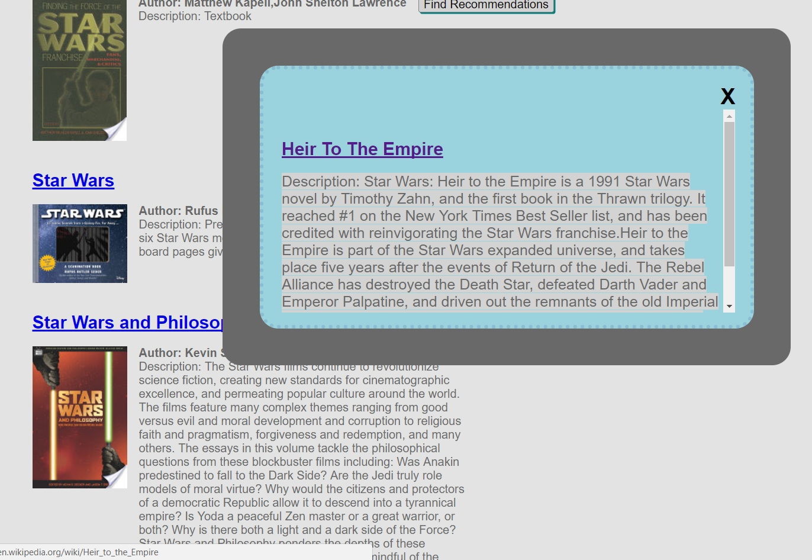

This is an Asynchronous Web Apps Capstone Project by Joey Wolter.
My project takes a search term provided by a user, and pushes it to the Google Books API. Google Books returns a list of books comparable to the search term entered. The user can then find a book they are interested in and click on the Find Recommendations button. The selected book title is ran through the TasteDive API which returns similar books, if any are found.

https://book-search-recommendations.glitch.me/

When you launch up my web app, you are greeted with the above page. If you enter a search term into the text box, it is sent to the Google Books API. The Google Books API then searches for books in it's database that match your search term. It will return a list of books that it considers close to your search term.

In this second screen capture, you can see how the results appear after you search for a book. A title with a clickable link to the google bookstore is displayed, accompanied by a thumbnail image of the cover, followed by the author and a description of the book. To the right is a button which passes the selected book title to the TasteDive API. TasteDive takes a search term and returns recommendations based on your book title.

In this last image we see a "popup" modal which displays our recommendation. This window is scrollablem disabling the main windows scroll bar to keep it in place. The data itself features a clickable book name which leads to the wikipedia page for the book. It is followed by a description of the recommended book. The modal can be closed with the X in the top right corner, which hides the modal and returns scroll function to the main window.

The TasteDive API allows you to search for other things such as movies, tv shows, and bands. However, I have chosen to restrict it to books only, to fit the theme of my web app. I was more or less satisified with the performance provided by TasteDive, as it sometimes returns no results if you search term is an obscure title. "Star Wars", for instance, returns recommendations. However, "Star Wars and Philosopy" does not. This is frustrating since the TasteDive website itself will return results based on any search term. Using the API seems to limit you to general searches.

Overall I am satisifed with the outcome of this web app, and it was a great learning experience.
